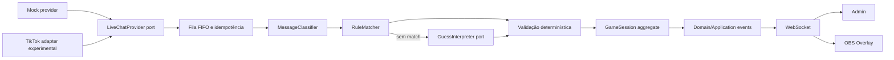

# Arquitetura

## Fluxo principal

O LLM termina no objeto `GuessInterpretation`. Somente `GameSession.findDifference` altera diferença, pontuação e conclusão.

## Camadas

- **Domain:** `PuzzleDefinition`, validação, normalização e `GameSession`. Zero I/O.
- **Application:** portas, classificação, matching, fila, idempotência, métricas, templates e casos de uso.
- **Infrastructure:** OpenAI, TikTok, arquivo/PostgreSQL e console responder em `apps/api/src/adapters`.
- **Presentation:** rotas Fastify, WebSocket e React.

As importações apontam para dentro: presentation/infrastructure → application → domain/shared. O domínio jamais importa adapters.

## Concorrência e idempotência

`enqueueComment` encadeia uma Promise por processo, estabelecendo FIFO pela ordem de entrada na aplicação. `providerEventId` é reservado no início do item da fila. Depois da interpretação, `findDifference` confere status/disponibilidade, marca, atribui usuário, pontua e conclui sem `await`, formando uma seção crítica indivisível no event loop.

Em produção multi-instância, essa garantia deixa de ser suficiente. A evolução prevista é uma transação PostgreSQL com unique key do evento e update condicional da diferença, ou advisory lock por sessão. O V0 declara uma réplica como requisito operacional.

## Realtime

O backend publica snapshots completos porque o estado tem sete diferenças e dezenas de comentários, simplificando reconexão e consistência. Admin e Overlay recebem o mesmo contrato `PublicGameState`. Se o socket cair, o frontend reconecta e também pode carregar `/api/state`.

## Persistência

- Sem `DATABASE_URL`: append-only NDJSON com permissão de usuário.
- Com `DATABASE_URL`: `game_events` em PostgreSQL/Supabase.
- `puzzles` possui constraint de sete diferenças e seed idempotente.
- A sessão ativa permanece intencionalmente em memória.

## Segurança

- Segredos existem apenas no processo da API e `.env` é ignorado pelo Git.
- Logger redige Authorization e Cookie.
- Comentário é truncado, classificado e nunca vira system prompt.
- O adapter OpenAI não expõe ferramentas e valida ID/threshold após Structured Output.
- TikTok WRITE requer flag explícita, sessão e rate limit.
- O V0 não autentica Admin; bind/exposição pública precisam de proxy/autenticação fora deste escopo.

